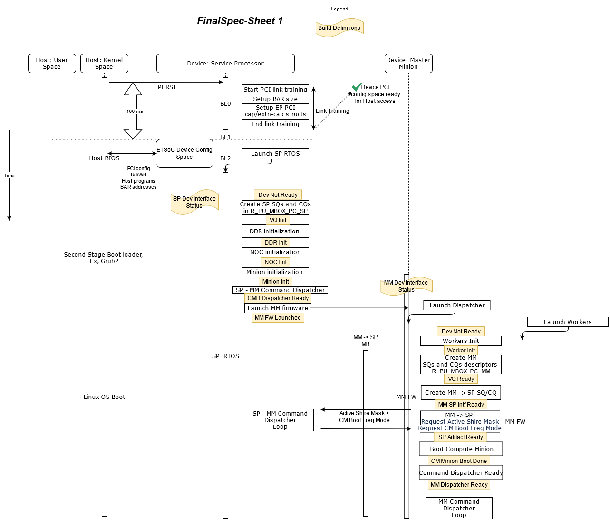

Device BootLoader->BL2 Overview
===============================

Device Discovery Sequence Diagram
---------------------------------

Boot Process
------------
Reference: https://esperantotech.atlassian.net/wiki/spaces/SW/pages/596574300/Boot+Process

Device Only Reset Architecture
------------------------------
Steps (as depicted in the figure below).

- Host informs Device to start Quiesce all Device traffic

  - SP RT will inform to MM RT to quiesced all traffic
  - MM RT will send an asynchronous event to PCIe Kernel driver to stop receiving new IOCTL requests from Host runtime. After which, any new request from Host runtime will get “Error::Device not ready“ status
  - PCIe driver sends “Quiesce Ack“ command to MM RT to ack all traffic has been stopped from getting to device.
  - MM RT will then acknowledges SP RT that all traffic has been quiesced
  - SP will then send response to DM lib thats it ready to receive the “Device Quiesced”

- DM Lib requests PCIE Kernel driver to copy the image of the new firmware image into the DIR advertised “Device Management Scratch Region“.1
- DM Lib then request the SP RT to copy the image from “Device Management Scratch Region“ into secondary partition of the on-package flash
- Upon completion of the new image copy, DM lib will issue a Device Management “Firmware Update” command to the SP RT.

  - SP RT will save off the contents of the BAR registers from the device PCIE HW registers into pre-allocated on package SPI Flash region
  - SP RT will also swap the boot priority counter
  - SP RT will also program a WatchDog Timer in external PMIC to auto issue ET SOC reset if SP RT does NOT clear the WDT in a given time. This is to help the case where new firmware image has hung during boot.2
  - Then SP will program the external PMIC to toggle PERSTN upon SW Reset request
  - SP RT will then request PMIC to toggle ET SOC reset3
  - SP RT will come out of reset execute the cold reset flow, and eventually try to boot from the new partition since the priority counter has been swapped.

    - In BootROM phase 4 PCIE link training will be initiated by device towards Host Root Complex. In the process it will also restore the saved BAR state from Flash - since Host OS is not aware device has been reseted.
    - In BootROM phase 5,  the SP will try to verify the signature of the new image. If authentication fails, the SP will automatically revert to the previous known working image and update status as “Fail to boot“. Note there could be other failure during booting of the new firmware image, at which point, the boot status will be updated “Failure:: Reason for failure“ and SP will automatically revert to the previous known working image.

- DM lib will then request PCIe Kernel driver to read status of Mgmt DIR and Ops dir to check if the “Boot status = Success”.

  - If successful, PCIE Driver will update state to allow new IOCTL commands to be received from host runtime via Ops node.
  - If not, then DM Lib will send “Revert FW“ command to SP to revert to previous working image which is still in on a separate partition in the on-package SPI flash partition

    - Same steps as Firmware Update sequence, with only difference being, there is no download of new Firmware, instead just swap the boot priority counter back so upon re-boot, the previous Firmware will be used.

- DM lib will finally issue to “ETSOC1_IOCTL_UPDATE_BOOT_COUNTER“ SP RT to update its boot counter

  - SP RT will increment the boot counter in Flash, the new FM image will then become the new last known “good” image

BL2 Interfaces
--------------

BL2 Device Management (DM) Support
..................................
The BL2 provides support for managing DM services over PCIe interface aka InBand DM:

- **Asset Tracking and Management** : The asset tracking service provides information about hardware and software assets present on the chip such as manufactures name, form factor, firmware version, etc.
- **Thermal and Power Management** : This service deals with the thermal and power management of the chip such as providing the chip temperature, voltage, power, setting the temperature thresholds etc.
- **Error Monitoring and Control** :	This services allows the host to configure threshold for various bus and memory errors.
- **Link Management** : This service handles link management requests such as PCIE rest, get link width etc.
- **Performance Management** : Provides performance metric such as chip utilization, memory BW, clocks frequencies etc
- **Master Minion (MM) State** : Provides execution state of Master Minion
- **Historical Extreme Values** : Provides the historical maximum value for various chip parameters such as temperature, bus and memory error count, etc.
- **Firmware Update** : Provides the support to update the SP and MM firmware.

Architecture
............

The figure below depicts the architecture of DM services in the BL2.

MSI ISR
^^^^^^^

The ISR function handles the interrupt triggered by the host PCIE driver. Host triggers the interrupt after copying the DM request message to Submission Queue (SQ). The ISR notifies the availability of DM command to command dispatcher task.

DM Command Dispatcher Task
^^^^^^^^^^^^^^^^^^^^^^^^^^

The DM command dispatcher task handles all the incoming DM services requests from the host. This task waits on the notification from the ISR to commence the request processing. The DM task performs the following operations:

- Pops the DM request from the SQ
- Parses the request and dispatches the request to appropriate DM service driver
- Pushes the response to Completion Queue(CQ)

DM Service Driver
^^^^^^^^^^^^^^^^^

This component handles low-level details to get/set hardware parameters. The DM service driver has a function call interface with the dispatcher task and all the calls are initiated by it. The DM service driver  returns or configures the required parameters from the following sources:

- **Global structures** : Populated by the DM sampling task
- **Hardware registers** : Parameters which are obtained or configured directly in registers
- **PMIC** : Parameters which are obtained or configured via PMIC
- **MM** : Parameters obtained from the MM

DM Sampling Task
^^^^^^^^^^^^^^^^

This thread periodically samples the hardware resources (hardware registers and PMIC) and saves the values in the global data structure. These values are fetched by the appropriate service driver in response to command dispatcher request. The cached values are used to minimize the request processing latency.

Processing Model
^^^^^^^^^^^^^^^^

- Host pushes the DM request command in the Submission Queue
- Host inform the Service Processor using a PCIe interrupt
- The SP PCIe ISR wakes up the Command dispatcher task
- Command dispatcher task pops the message from the SQ
- Command dispatcher task parses the command header
- Command is dispatched to the appropriate DM service handler
- The Service handler will execute the command and respond with the appropriate status
- The response in the form of a packet is pushed into the CQ
- Then a PCIe interrupt is sent to the host to inform the availability of the response
- Host DM library will according process the response and update the User application

Service Processor - Master Minion API
.....................................
https://esperantotech.atlassian.net/wiki/spaces/SW/pages/766673226/Service+Processor+-+Master+Minion+API

Service Processor - PMIC Interface
..................................
https://esperantotech.atlassian.net/wiki/spaces/SW/pages/1199570960/Service%2BProcessor%2B-%2BPMIC%2BInterface

FreeRTOS
--------
The Service Processor runs FreeRTOS and so software components can be written and executed as FreeRTOS Tasks.
FreeRTOS is an open source software project (available under the MIT license; a commercial license is also available). Pointer to the list of APIs_'. As of current requirement, the existing API seems sufficient to implement all the ET requirements.

.. _APIs: https://www.freertos.org/a00106.html

Device Software Memory Layout
-----------------------------

Service Processor Layout
........................

+-----------+-----------------------+-----------+-----------+-----------+-----------+
| **All     | **ET SOC              | **BAR**   | **BAR     | **Size    | **Access  |
| ocation** | Memory                |           | Offset**  | (Bytes)** | ibility** |
|           | Region**              |           |           |           |           |
+-----------+-----------------------+-----------+-----------+-----------+-----------+
| Service   | R_SP_ROM              | N/A       |           | 128K      | Not       |
| Processor |                       |           |           |           | Mapped    |
| Boot ROM  |                       |           |           |           |           |
+-----------+-----------------------+-----------+-----------+-----------+-----------+
| Service   | R_SP_SRAM             | N/A       |           | 1 M       | Not       |
| Processor |                       |           |           |           | Mapped    |
| Boot RAM  |                       |           |           |           |           |
+-----------+-----------------------+-----------+-----------+-----------+-----------+
| Service   | R_SP_SPIO0(Substrate  | N/A       |           | 64 K      | Not       |
| Processor | Flash)                |           |           |           | Mapped    |
| Fi        |                       |           |           |           |           |
| rmwareBL1 |                       |           |           |           |           |
+-----------+-----------------------+-----------+-----------+-----------+-----------+
| Service   |                       | N/A       |           | 64 K      | Not       |
| Processor |                       |           |           |           | Mapped    |
| Fi        |                       |           |           |           |           |
| rmwareBL2 |                       |           |           |           |           |
| (         |                       |           |           |           |           |
| Including |                       |           |           |           |           |
| RTOS)     |                       |           |           |           |           |
+-----------+-----------------------+-----------+-----------+-----------+-----------+
| Service   | PU_M                  | BAR 2     | 0         | 1K        | **Host    |
| Processor | BOX_PC_SP             |           |           |           | Kernel    |
| Device    |                       |           |           |           | Space**   |
| Interface |                       |           |           |           |           |
| Register  |                       |           |           |           |           |
+-----------+-----------------------+-----------+-----------+-----------+-----------+
| Service   | PU_M                  | BAR 2     | 0x400     | 2K        | **Host    |
| Processor | BOX_PC_SP             |           |           |           | Kernel    |
| Virtual   |                       |           |           |           | Space**   |
| Queue     |                       |           |           |           |           |
| Buffers   |                       |           |           |           |           |
+-----------+-----------------------+-----------+-----------+-----------+-----------+
| Service   | R_PU_TRG_PCIE1        | BAR 2     | 0xC00     | 8K        | **Host    |
| Processor |                       |           |           |           | Kernel    |
| Virtual   |                       |           |           |           | Space**   |
| Queue     |                       |           |           |           |           |
| Interrupt |                       |           |           |           |           |
| Trigger   |                       |           |           |           |           |
+-----------+-----------------------+-----------+-----------+-----------+-----------+
| Device    | DDR User              | BAR 0     | 0x0       | 4M        | **Host    |
| M         | Memory                |           |           |           | Kernel    |
| anagement | Sub                   |           |           |           | Space**   |
| Scratch   | Region                |           |           |           |           |
+-----------+-----------------------+-----------+-----------+-----------+-----------+
| SP DM     | DDR User              | BAR 0     | 0x400000  | 4K        | **Host    |
| services  | Memory                |           |           |           | Kernel    |
| Trace     | Sub                   |           |           |           | Space**   |
| Buffer    | Region                |           |           |           |           |
+-----------+-----------------------+-----------+-----------+-----------+-----------+

Minion Runtime Layout
.....................

+-----------+-----------+-----------+-----------+-----------+-----------+
| **All     | **ET SOC  | **BAR**   | **BAR     | **Size**  | **Access  |
| ocation** | Memory    |           | Offset**  |           | ibility** |
|           | Region**  |           |           |           |           |
+-----------+-----------+-----------+-----------+-----------+-----------+
| Minion    | PU_P      | BAR 2     | 0x1000    | 1K        | **Host    |
| Device    | C_MM_MBOX |           |           |           | Kernel    |
| Interface |           |           |           |           | Space**   |
| Register  |           |           |           |           |           |
+-----------+-----------+-----------+-----------+-----------+-----------+
| Master    | PU_P      | BAR 2     | 0x1400    | 2K        | **Host    |
| Minion    | C_MM_MBOX |           |           |           | Kernel    |
| Virtual   |           |           |           |           | Space**   |
| Queue     |           |           |           |           |           |
| Buffers   |           |           |           |           |           |
+-----------+-----------+-----------+-----------+-----------+-----------+
| Master    | Shares    | N/A       |           |           | **Host    |
| Minion    | same      |           |           |           | Kernel    |
| Virtual   | Space     |           |           |           | Space**   |
| Queue     | with SP + |           |           |           |           |
| Interrupt | 4 offset  |           |           |           |           |
| Trigger   |           |           |           |           |           |
+-----------+-----------+-----------+-----------+-----------+-----------+
| MM → CM   | DDR SData | N/A       |           | 1K        | Not       |
| Transport | Sub       |           |           |           | Mapped    |
| MultiCast | Region    |           |           |           |           |
| Broadcast |           |           |           |           |           |
+-----------+-----------+-----------+-----------+-----------+-----------+
| CM → CM   | DDR SData | N/A       |           | 1K        | Not       |
| Transport | Sub       |           |           |           | Mapped    |
| UniCast   | Region    |           |           |           |           |
+-----------+-----------+-----------+-----------+-----------+-----------+
| Master    | DDR User  | BAR 0     | 0x401000  | 512K16K   | **Host    |
| Minion FW | Memory    |           |           | per Hart  | Kernel    |
| Trace     | Sub       |           |           | x 32      | Space**   |
| Buffer    | Region    |           |           | H         |           |
|           |           |           |           | ARTS(Only |           |
|           |           |           |           | Lower 32  |           |
|           |           |           |           | HARTs     |           |
|           |           |           |           | pa        |           |
|           |           |           |           | rticipate |           |
|           |           |           |           | in Minion |           |
|           |           |           |           | Runtime ) |           |
+-----------+-----------+-----------+-----------+-----------+-----------+
| Compute   | DDR User  | BAR 0     | 0x481000  | 512K16K   | **Host    |
| Minion FW | Memory    |           |           | per 1st   | Kernel    |
| Trace     | Sub       |           |           | Hart of   | Space**   |
| Buffer    | Region    |           |           | Shire x   |           |
|           |           |           |           | 32        |           |
|           |           |           |           | Compute   |           |
|           |           |           |           | ShireHave |           |
|           |           |           |           | space for |           |
|           |           |           |           | only 1 CM |           |
|           |           |           |           | FW to     |           |
|           |           |           |           | dump      |           |
|           |           |           |           | trace at  |           |
|           |           |           |           | once      |           |
+-----------+-----------+-----------+-----------+-----------+-----------+
| Hole      |           |           |           |           |           |
+-----------+-----------+-----------+-----------+-----------+-----------+
| User Mode | DDR User  | BAR 0     | 0x600000  | 15 GB     | **Host    |
| Compute   | Memory    |           |           |           | User      |
| Kernel    | Sub       |           |           |           | Space**   |
|           | Region    |           |           |           |           |
+-----------+-----------+-----------+-----------+-----------+-----------+

Note: 1 these are the same BAR range exposed between MM and SP

Service Processor Runtime Error Handling
----------------------------------------

+-----------------------+-----------------------+-----------------------+
| **Error Type**        | **Recover Type**      | **Action**            |
+-----------------------+-----------------------+-----------------------+
| SP Runtime hang       | Recovered by SP       | Dump Execution        |
|                       | Watchdog interrupt,   | Context to            |
|                       | Runtime Interrupt     | Pre-defined Error     |
|                       | handler cleaning up   | Trace BufferSend an   |
|                       | state, and return to  | Error Event           |
|                       | RTOS main taskOnce    | notification to Host  |
|                       | 2nd SP WDT, HW will   | - details_            |
|                       | have a request to     | ``SP _RUNTIME_HANG``  |
|                       | PMIC to reset the     |                       |
|                       | whole ET SOC          |                       |
|                       |                       |                       |
|                       |                       |                       |
|                       |                       |                       |
|                       |                       |                       |
|                       |                       |                       |
|                       |                       |                       |
|                       |                       | PCie                  |
|                       |                       | Driver will extract   |
|                       |                       | the context from      |
|                       |                       | device (Using Pointer |
|                       |                       | as from Event         |
|                       |                       | Syndrome).Naturally   |
|                       |                       | after handling WDT    |
|                       |                       | ISR, the RTOS will    |
|                       |                       | try to recover,       |
|                       |                       | however if it crashed |
|                       |                       | again, the WDT will   |
|                       |                       | fire again but        |
|                       |                       | instead will issue a  |
|                       |                       | ET SOC reset request  |
|                       |                       | to the PMICNote: ET   |
|                       |                       | SP Runtime provides a |
|                       |                       | custom Interrupt      |
|                       |                       | handler to override   |
|                       |                       | FREE RTOS             |
|                       |                       | version               |
|                       |                       | Implementation:       |
|                       |                       | here_                 |
|                       |                       |                       |
|                       |                       |                       |
|                       |                       |                       |
|                       |                       |                       |
|                       |                       |                       |
|                       |                       |                       |
|                       |                       | Layout                |
|                       |                       | of Execution Context  |
|                       |                       | defined below         |
+-----------------------+-----------------------+-----------------------+
| SP Runtime Exception  | Recovered by Runtime  | Dump Execution        |
|                       | Exception handler     | Context to            |
|                       | cleaning up state,    | Pre-defined Error     |
|                       | and return to RTOS    | Trace BufferSend an   |
|                       | main task             | Error Event           |
|                       |                       | notification to Host  |
|                       |                       | - details_            |
|                       |                       | SP_RUNTIME_EXCEPTION  |
|                       |                       |                       |
|                       |                       |                       |
|                       |                       |                       |
|                       |                       |                       |
|                       |                       |                       |
|                       |                       |                       |
|                       |                       |                       |
|                       |                       |                       |
|                       |                       | Spin                  |
|                       |                       | in loop - waiting for |
|                       |                       | Host to resetNote: ET |
|                       |                       | SP Runtime provides a |
|                       |                       | custom Exception      |
|                       |                       | handler to override   |
|                       |                       | FREE RTOS version     |
+-----------------------+-----------------------+-----------------------+
| SP Runtime Error      | Continue execution as | When the following is |
|                       | normal, its up to     | encountered in SP     |
|                       | Host Application to   | RT:\*                 |
|                       | handle decide on what | ``Log_Write()``       |
|                       | to do.                |                       |
|                       |                       | RT will update a      |
|                       |                       | global counter which  |
|                       |                       | tracking # of         |
|                       |                       | errors.When Threshold |
|                       |                       | is hit, an Error      |
|                       |                       | Event Notification    |
|                       |                       | (SP_RUNTIME_ERROR_THR |
|                       |                       | ESHOLD)               |
|                       |                       | will be sent to the   |
|                       |                       | Host.Host will pull   |
|                       |                       | thee historical       |
|                       |                       | buffer to keep track  |
|                       |                       | of the last N Error   |
|                       |                       | events which occurred |
|                       |                       | within the SP RU      |
+-----------------------+-----------------------+-----------------------+

.. _detail: https://esperantotech.atlassian.net/wiki/spaces/SW/pages/1647739547/Device+Management+Work+Package+4+-+Requirements+Design+In+progress#Event%2FError-Class
.. _here: https://gitlab.esperanto.ai/software/device-bootloaders/-/blob/master/src/ServiceProcessorBL2/driver/interrupt.c#L178

Note:

In BL2, we are creating RTOS as a Static task, hence there is no need to
free when a Crash happens.

Format of Error Context Layout

+-----------------------+----------------------------------------------------------+-----------------------+
| **Field**             | **Possible values**                                      | **Size**              |
+-----------------------+----------------------------------------------------------+-----------------------+
| * Cycle               | The cycle as sampled                                     | uint64_t              |
|                       | from the system                                          |                       |
|                       | counters at the point                                    |                       |
|                       | where the event type                                     |                       |
|                       | has happened. Its                                        |                       |
|                       | accurate to within                                       |                       |
|                       | 100 cycles.                                              |                       |
|                       | (``timer_get_ticks_count()``)                            |                       |
|                       |                                                          |                       |
+-----------------------+----------------------------------------------------------+-----------------------+
| * Type                | * 0 - SP Runtime hang (1st Level Recovery)               | uint64_t              |
|                       | This                                                     |                       |
|                       | event is sent to                                         |                       |
|                       | inform host that the                                     |                       |
|                       | Device had hang, and                                     |                       |
|                       | execution context                                        |                       |
|                       | pointer attached to                                      |                       |
|                       | this event would                                         |                       |
|                       | provide context of                                       |                       |
|                       | what Task was running                                    |                       |
|                       | prior to the hang                                        |                       |
|                       |                                                          |                       |
|                       | * 1 - SP Runtime exception                               |                       |
|                       | This                                                     |                       |
|                       | event is sent to                                         |                       |
|                       | inform host that the                                     |                       |
|                       | Device had taken an                                      |                       |
|                       | exception, and                                           |                       |
|                       | execution context                                        |                       |
|                       | pointer attached to                                      |                       |
|                       | this event would                                         |                       |
|                       | provide context of                                       |                       |
|                       | what Task was running                                    |                       |
|                       | prior to the hang                                        |                       |
|                       |                                                          |                       |
|                       | * 2 - SP Runtime hang (2nd Level Recovery)               |                       |
|                       | This event is sent                                       |                       |
|                       | to inform host that                                      |                       |
|                       | the Device had                                           |                       |
|                       | re-boot itself and                                       |                       |
|                       | sent the causation                                       |                       |
|                       | value as read from                                       |                       |
|                       | PMIC (details_)                                          |                       |
|                       |                                                          |                       |
|                       |                                                          |                       |
|                       |                                                          |                       |
|                       |                                                          |                       |
|                       |                                                          |                       |
|                       |                                                          |                       |
|                       |                                                          |                       |
|                       | * 3 - SP Error                                           |                       |
|                       | Count beyond                                             |                       |
|                       | Threshold \* This                                        |                       |
|                       | event is sent to                                         |                       |
|                       | inform host that the                                     |                       |
|                       | Device Runtime had                                       |                       |
|                       | gone beyond the                                          |                       |
|                       | accepted Error                                           |                       |
|                       | Threshold. This                                          |                       |
|                       | message will be                                          |                       |
|                       | attached with the                                        |                       |
|                       | pointer to the                                           |                       |
|                       | Historical Error                                         |                       |
|                       | Buffer                                                   |                       |
+-----------------------+----------------------------------------------------------+-----------------------+
| * 31 GPR (uint64_t)   | Follows the RiscV ABI                                    | 31 \* {uint64_t}      |
|                       | for register mapping:                                    |                       |
|                       |                                                          |                       |
|                       | x1 ra return address                                     |                       |
|                       |                                                          |                       |
|                       | x2 sp stack pointer                                      |                       |
|                       |                                                          |                       |
|                       | x5-7 t0-2 temporary                                      |                       |
|                       | registers                                                |                       |
|                       |                                                          |                       |
|                       | x8 s0 / fp                                               |                       |
|                       | saved register /                                         |                       |
|                       | frame pointer                                            |                       |
|                       |                                                          |                       |
|                       | x9 s1 saved register                                     |                       |
|                       |                                                          |                       |
|                       | x10-11 a0-1 function                                     |                       |
|                       | arguments / return                                       |                       |
|                       | values                                                   |                       |
|                       |                                                          |                       |
|                       | x12-17 a2-7 function arguments                           |                       |
|                       |                                                          |                       |
|                       | x18-27 s2-11 saved registers                             |                       |
|                       |                                                          |                       |
|                       | x28-31 t3-6 temporary registers                          |                       |
+-----------------------+----------------------------------------------------------+-----------------------+
| * Exception Context   | * mepc                                                   | 4 \* {uint64_t}       |
|                       | * mstatus                                                |                       |
|                       | * mtval                                                  |                       |
|                       | * mcause                                                 |                       |
+-----------------------+----------------------------------------------------------+-----------------------+
| * Global State        | * Performance structure                                  |                       |
|                       | .. code:: c                                              |                       |
| Note                  |                                                          |                       |
| these will remain in  |   struct asic_frequencies_t                              |                       |
| the Trace Buffer, and |   uint32_t dram_capacity_percent;                        |                       |
| it’s up to the Host   |   uint64_t last_ts_min;                                  |                       |
| application to pull   |                                                          |                       |
| this information as   | * Power Management                                       |                       |
| when needed.          | .. code:: c                                              |                       |
|                       |                                                          |                       |
|                       |   power_state_e module_powero_state;                     |                       |
|                       |   tdp_level_e module_tdp_level;                          |                       |
|                       |   uint8_t soc_temperature;                               |                       |
|                       |   uint8_t soc_power;                                     |                       |
|                       |   uint8_t soc_power;                                     |                       |
|                       |   struct module_uptime_t module_uptime;                  |                       |
|                       |   struct module_voltage_t module_voltage;                |                       |
|                       |   uint64_t throttled_states_residency;                   |                       |
+-----------------------+----------------------------------------------------------+-----------------------+
| * Historical Error    | * Historical Error Field Buffer                          | 10 \* {uint64_t,      |
|   Buffer              | which is                                                 | uint16_t}             |
|                       | stored by SP RT when                                     |                       |
|                       | any Errors where the                                     |                       |
|                       | code says:                                               |                       |
|                       | ``Log_Write(LOG_LEVEL_ERROR)``                           |                       |
|                       | is encountered.                                          |                       |
|                       |                                                          |                       |
|                       | .. code:: c                                              |                       |
|                       |                                                          |                       |
|                       |   <Cycle>:Error ENUM #1                                  |                       |
|                       |   ...                                                    |                       |
|                       |   <Cycle>:Error ENUM #10                                 |                       |
|                       |                                                          |                       |
|                       | where:                                                   |                       |
|                       |                                                          |                       |
|                       | * This is a circular buffer which keeps the last 10      |                       |
|                       |   errors                                                 |                       |
|                       | * Cycle - ``timer_get_ticks_count()``                    |                       |
|                       | * There is a global counter which keeps track of this    |                       |
|                       |   Error count (cleared on Reset), and will trigger       |                       |
|                       |   Event: ``SP Error Count beyond Threshold`` when this   |                       |
|                       |   counter hits the Threshold (Default set to 10)         |                       |
|                       |                                                          |                       |
+-----------------------+----------------------------------------------------------+-----------------------+

.. _details: https://esperantotech.atlassian.net/wiki/spaces/SW/pages/1199570960/Service%2BProcessor%2B-%2BPMIC%2BInterface#Catastrophic-Failure
