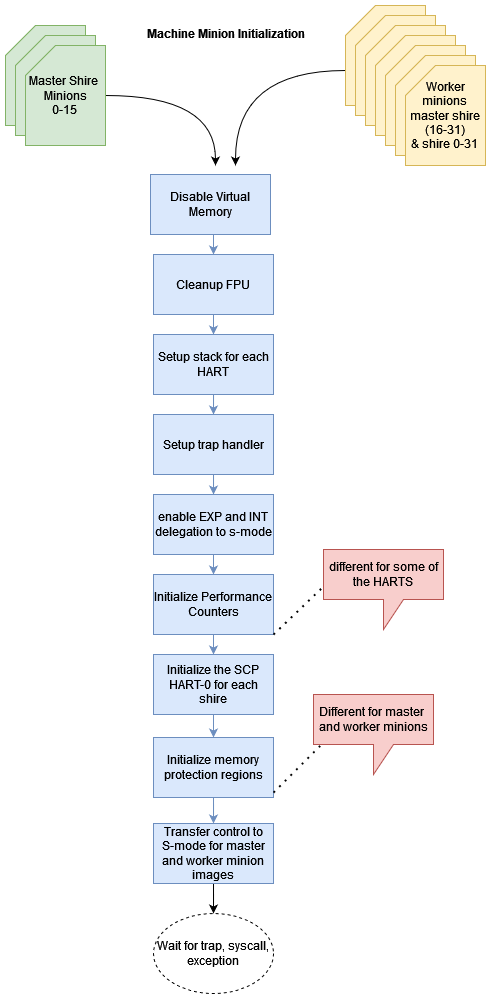

.. _Machine Minion Firmware:
=======================
Machine Minion Firmware
=======================

The machine minion firmware executes at Machine-Mode(m-mode) privilege level and it used by both master and compute minions.
The firmware provides three key features:

- Configures the hardware resources at boot time as required by supervisor-mode(s-mode) software on master and worker minions
- Provides low level privileged operations to s-mode and u-mode software via system call
- Traps exceptions & interrupts and delegates them to the s-mode

.. _Boot Time Initializations:
*************************
Boot Time Initializations
*************************
The machine mode code performs following boot time operations:

- Disables the virtual memory
- Clears FPU state
- Sets up the m-mode stack for each HART
- Sets up machine mode trap handler and enable delegation of u-mode exception (such as illegal instructions) and software, timer and external interrupts to the S-mode
- Initializes the performance counters
  - The counter initialization is different for HARTs and not all the HARTS configure every performance counter. For instance, Cycle counters are enabled for first minion of each neighborhood, whereas, L2 miss counters are configured for each HART.
- Initializes the SCP region from HART 0 of each shire
- Configures the memory protection for master shire (lower 16 minions of shire 32) and compute minions. The permissions are enforced at neighborhood level. The access permissions are different for master and compute minion. For instance, master minions are allowed PCIE access but it is prohibited for the worker minions.
- Transfers control to the master and worker minions code in s-mode.

.. _Machine Mode Services:
*********************
Machine Mode Services
*********************

The m-mode component provides low level, most privileged services to s-mode and u-mode. This includes:

- Cache maintenance operations
- PMC configuration, sampling and reset
- Threads control e.g. thread 1 enablement
- Dynamic frequency update
- IPI generation

These services are used by both master and worker minions software in supervisor and user modes. These services are provided via a system calls (ECALL instruction). User mode cannot directly call machine mode service. It requests supervisor mode using the system call which either handles it locally or passes it to machine mode.

Master Minion Firmware
======================

Master minion firmware uses machine mode service to:

- Trigger IPI
  - Multicast
  - Broadcast
  - Unicast
- Update PLL frequency
- Configure worker minion

Worker Minion
=============

The worker minion software executes in s-mode(worker minion firmware) and u-mode(user kernel) and tuse different m-mode services

**Worker Minion U-mode uses:**

- Cache maintenance
- Shire cache and memshire PMC sampling

**Worker Minion S-mode uses :**

- IPI generation
- Cache maintenance
- PMC configuration
- Thread 1 enablementt

.. _Interrupts and Exceptions Delegation:
*************************************
Interrupts and Exceptions Delegation
*************************************

The machine mode code traps the IPI from the MM RT and exceptions from the u-mode kernel and delegates them to the s-mode firmware. The worker minion masks IPI and exeception in s-mode and to identify the minion state (e.g executing Kernel in user mode) and code path where the interrupt/exception was taken. This simplifies the kernel management in the s-mode firmware at the cost of performance.