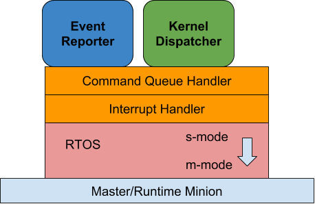

Master Minion Firmware  {#master_minion_firmware}
======================

## Software Stack
The Master and Sync Minions software stack looks like follows:

<!---
Source google-doc
https://docs.google.com/drawings/d/1B7zEIsVYdDNmL5K6YcmqsAkbiSEiYeFUQA15ljCBEvc/edit?usp=sharing
--->

As master/runtime minions are not visible to user kernels,
they should never execute in user mode privilege. In the S-mode there
will be an RTos device runtime software. The RTos can only be
run in the master and runtime minions (minions 0..15 of the
shire 32). On m-mode there will be a thin m-code that will provide
low level services that are not supported directly by hardware (setting SATP, …).

\todo Guillem, From Ioannis: The above sentence is confusing to me.

### S-mode calls to M-mode

Fill what are the explicit services that the RTos device runtime software will request to m-code.

### M-mode “transparent” traps

Same as compute minion

## Communication Mechanisms Between Sync and Compute Minions

\todo Guillem we need to clarify the following paragraph:

Compute and sync minions can communicate only with the runtime minions (assuming that master minion delegates the execution handling to one or several runtime minions). APIs

* Kernel done: when a kernel yields a minion, the minion goes to S-mode. After the minion state cleanup done by the bare-metal software, it should notify the runtime minion in charge that the minion is available. One option is first checking that all the minions in a shire are done and the last one notifies the runtime minion. Implementation options:

  * Doing an interrupt is likely too slow: there would be a total of 32 interrupts to notify that each shire is done
  *  Using ports is not safe because u-mode code can write to them (with 1GByte pages there’s no shire_id granularity through the page table)
  * Doing an atomic increment and add in a position of the L3 of the master shire and having the runtime minion doing an active poll seems the most reasonable option

* Kernel error: same as before, but need to set a variable to 1 to let the runtime minion that there was a problem in the clean up process (Tensor* not in idle state)

### Communication Mechanisms Between Master and Runtime Minions

\todo Guillem's Questions
* Master to Runtime: spawn a new thread. Done through IPI? Dependent on RTos?
* Runtime to Runtime: can a runtime spawn a new thread?
* Runtime to Compute/Sync: start a new kernel. Done through IPI.
* Runtime to Master: notify that something finished: kernel, mem transfer, ...
