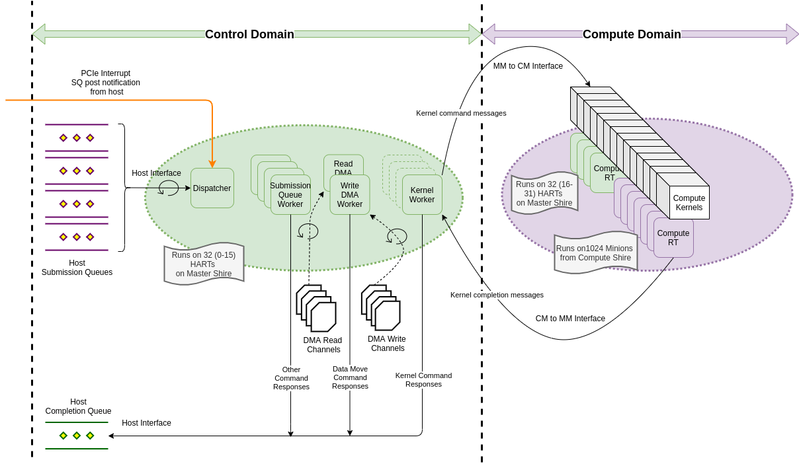

.. _Background:
============================================
Background - Host/Device System Architecture
============================================
Figure 0 below illustrates the overall system architecture and identifies the key components in
the host and device side software. Blocks marked in green are components relevant to the operational
data path that enables host userspace software to offload compute to the ETSoC1 device for
compute acceleration.

The operational data path consists of host side software stack, and device side software stack.
The host userspace submits operational commands using the *Device Ops API* conformant bindings
to the appropriate ETSoC1 device node (/dev/etX_ops). For more information refer to the Linux PCIe
driver documentation.

The kernel space ETSoC1 PCIe driver fields the userspace submitted commands and fowards the
*Device Ops API* commands to the device Master Minion RunTime (MM RT) firmware using one to many
Submission Queues (SQs). The number of SQs supported by device is discovered by host during
initialization from Device Interface Registers (DIRs). More details on ths topic discussed in
sections below.

The device MM RT firmware processes the *Device Ops API* commands received. The MM RT firmware features a
multi-threaded firmware architecture designed to enable parallelism in command processing. Results from
command processing are transmitted to the Host PCIe Kernel driver using *Device Ops API* conformant
responses using a single Completion Queue (CQ).

The rest of this document focusses on the green blocks shown in the Device side illustrated in
Figure 0. Details of Master Minion RunTime firmware architecture and components, and
Compute Minion firmware architecture and components are discussed in detail.

**Figure 0: Hot and Device - System Architecture, Components, Data Flow**

.. _Minion Firmware:
======================
Minion Firmware
======================

The ETSoC device consists 32 Compute Shires, and 1 special shire called the Master Shire.
Each Shire consist 32 Minions, and each Minion consists 2 hardware threads. Each hardware
thread is identified by a unique HART ID.

As shown in Figure 1 below, the device firmware running on Minions implement a control domain,
and a compute domain.

**Control Domain:** The control domain executes the *Master Minion Runtime* (MM RT) firmware whose
role is to; initialize the system, receive commands from host, decode and process commands.
Processing of commands could occur on the control domain or dispatched to compute domain.
The Master Minion runtime implements a software architecture that attempts to maximize
parallelization of command processing on the ETSoC Device. The *Master Minion Runtime* ,
is a baremetal software environment that runs across the first 16 Minions (i.e., the first
32 hardware threads) in the Master Shire to support the functionality required of the control
domain. Figure 1 shows the control domain in green.

**Compute Domain:** The compute domain executes the *Compute Minion Runtime* firmware whose role is
to field and process commands from *Master Minion Runtime*, and to properly transfer control
and execute/manage compute kernels offloaded from host for compute acceleration. The compute
kernels execute in U-Mode. The *Compute Minion Runtime* is baremetal software that runs on the second
16 Minions in the Master Shire, and the 32 Compute Shires dedicated for compute to support the
functionality required of the compute domain. Figure 1 shows the compute domain in purple.

**Figure 1: Master Minion Runtime - Architecture, Components, Data Flow**

.. _Theory Of Operations:
**Master Minion Runtime (MM RT) - Interfaces and Theory of Operations**

.. _Interfaces:
**Interfaces:**

Figure 1 shows the key components in the system architecture. The key interfaces used by the
*Master Minion Runtime* are listed as follows. Except the Master Minion to Compute Minion
interface all other interfaces are implemented using a circular buffer based data structure
called the Virtual Queue (VQ). The Virtual Queue is an abstraction that consists a circular buffer
and an associated notification mechanism - typically an interrupt. The VQ data abstraction is
used to implement the Submission Queues (SQs), and Completion Queues (CQs) interface discussed in
the sections below.

**Host Interface:**

Figure 2 below shows the key interfaces which the Master Minion Shire interacts at the Hardware layer.
Note the Master Minion Shire is divided into 2 separate domain - 1 for performing tasks related
to scheduling operation commands from the Host, and 2 participate as part of the Compute Minion Shires
to execute Compute Kernels.
Tasks are distributed within the 16 Cores in Master Minion as follows:

  - **Dispatcher Core** - handle all interrupts on behalf of the Master Minion Runtime
  - **Submission Queue Worker** - handles poping command from the Virtual Queue buffer
                            and executing the command. There can be many SQW (upto 4) each
                            on executing on a separate Core
  - **DMA Workers** - handles checking status of pending DMA channels, and handling completion of the
                respective channels. Note there are 2 Workers handling: RX channels and TX channels
  - **Kernel Workers** - handles checking status of pending Kernel execution on slots of Compute Minions
                   and handling completion of the kernel execution. Note there can be upto 2 as we
                   simultaneous Kernel execution - clusters of Compute Shires
  - **PMC Sampler** - handles sampling of Performance Counters for Shire Caches, MemShire, (NOC - TBD), PCI Controller
  - **Compute Minion PLL Freq Update Worker** - handles updating the Compute PLLs as per the DVFS algorithm

**Figure 2 : Master Minion Physical Shire and interfaces to different Hardware Interfaces

Host submits commands to device using the Host to Device Submission Queue (SQ) interface that serves
as the transport layer. A set of Command/Response bindings called the *Device Ops API* serves as the
logical layer using which host offloads work to the device minion runtime firmware.
[*Device Ops API* - add reference]

The number of Submission Queues exposed by the MM RT is a build time defined parameter in the
*Master Minion Runtime* configuration header. Host uses PCIe interrupt to notify Device of commands
posted to Submission Queue.

Device response to commands from Host using the Device to Host Completion Queue (CQ) interface using
*Device Ops API* specification conformant commands. A single completion queue is used in the system
for all device to host communications. Device uses MSI interrupts to notify host of command responses
posted to Completion Queue.

During MM RT initialization, minion firmware specific configuration parameters, and attributes are exposed
to the host interface using the Device Interface Registers (DIR)- SQ and CQ attributes, memory regions and
their attributes, MM RT firmware status to name a few. Refer to Linux kernel driver documentation for a
complete listing of DIRs.

.. _SP and MM Interface:
**Service Processor (SP) and Master Minion (MM) Interface**

Service Processor RunTime (SP RT) firmware and *Master Minion Runtime* (MM RT) exchange messages using
a SQ/CQ pair that serves as the transport layer enabling SP to MM communications. SP submits commands to
MM using the SP to MM SQ, and notifies MM using InterProcessor Interrupts (IPI). MM responds to commands
using the MM to SP CQ, and notifies SP using the R_PU_TRG_MMIN_SP interrupt. A similar SQ/CQ pair enables
MM to SP communications, with MM playing the role of master that initiates exchange.

**MM to SP interface Features:**
MM RT talks to SP RT over the VQs to obtain the boot time configurations used by the SP. This includes, active compute shires,
boot frequency and firmware version. Besides this, MM uses this interface to send heartbeat and request Minion reset.
Another important purpose serve by this interface is to carry the async notifications triggered by the MM RT for internal erros
such as CQ push, DMA configuration, SQ aligment, kernel time out etc. In response to these error events, SP RT sends error events to
host PCIe driver after the pre-defined error threshold has been reached. The PCIe driver logs events to the demsg which can be used
for further analysis.

**SP to MM Interface Features:**
SP RT does not request whole lot of info from the MM RT. There are just couple of instances where the SP initates the communication
with MM RT over the VQs. First is to ensure MM has booted up successfully by running the echo command and second to get the DRAM
badwidth usage.
SP configures the hardware to setup the required boot environemnt for the MM runtime. This is done by directly accesing MM control registers
such as ESR over MMIO. The configuration covers setting up the shire and neighborhood caches, PLLs,  load firmware, etc.
During the runtime, the same interface is used to scale voltage and frequency for power optimizations and keep the system
under the TDP limits.

A set of Command/Response bindings called the *SP to MM messaging specification* serves as the logical
layer using which SP and MM exchange messages during device runtime.
[*SP to MM messaging specification* - add reference]

.. _MM and CM Interface:
**Master Minion (MM) to Compute Minion (CM) Interface**

**MM to CM Interface:** The Submission Queue Worker (SQW) thread in MM RT handles compute kernel
execution related commands by submitting multicast commands to relevant Compute Minions (CM) specified
by the shire mask provided in said kernel execution commands. This interface serves as the transport layer
that enables MM RT to CM RT communications. A special single slot buffer serves as the transport mechanism
for this interface, and IPIs are used for notifications. The MM RT uses this interface for following operations:

- Kernel launch & abort
- Trace configuration and runtime control
- PMC configuration
- Cache operations

**CM to MM Interface:** *Compute Minion Runtime* (CM RT) transmits Kernel Command responses to the Kernel
Worker (KW) using circular buffer based tansport called the CM to MM unicast buffer. On completion
of user kernel execution, or in case of a error or an exception scenario, the relevant compute minion in
CM shire transmits command or error response to the KW using this interface. Furthermore, this interface is used to
report CW firmware errors such firmware RT errors and exceptions and shire status, executing in the supervisor mode.

A set of Command/Response bindings called the *MM to CM messaging specification* serves as the logical
layer using which MM RT manages CM RT for kernel execution and management.
[*MM to CM messaging specification* - add reference]

.. _Operations:
**Operations**

On boot, *Master Minion Runtime* firmware's C runtime entry point launches all software threads
in the system. In this implementation, a software thread is an independent baremetal execution
context with a dedicated stack that executes on one or both hardware threads on any given minion.
The software threads present in the *Master Minion Runtime* are listed below. The master minion
build configuration defines the HART ID to software thread assignments. A system spinlock synchronizes
the start of software threads in the system. The Dispatcher thread acquires the system lock and starts
execution first, while the rest of the threads spin waiting to acquire the system lock.

	- **Dispatcher**
	- **Submission Queue Worker (SQW)**
	- **Kernel Worker (KW)**
	- **DMA Worker (DMAW)**

**Dispatcher**

**Figure 2: Dispatcher Flow**

This thread is responsible for initializing the device resources (serial, trace, etc), other
software threads (workers), interfaces, Device Interface Registers (DIR). Post initialization,
the Dispatcher sets the MMRDY bit in the DIR to indicate to host that *Master Minion Runtime*
is ready to accept commands from host, and blocks waiting on a WFI to receive and process
following interrupts; PCIe interrupts from host to notify device of commands available to process
in Submission Queues, Software Interrupt (SWI) from machine mode used to convey Inter Processor
Interrupts (IPIs) from Service processor (SP).

.. _SQW:
**Submission Queue Worker**

Responsible for servicing commands in the associated Host to MM Submission Queue. For ''n''
Host to MM Submission Queues there are ''n'' SQWs. This thread is launched by main(). Post
initialization, it blocks waiting on a FCC event from the Dispatcher thread.

On receiving a FCC event from Dispatcher; the SQW pops available commands from the corresponding
Submission Queue, decodes the command, and routes the command for further processing.

*Compatibility, FW version, echo commands, and trace related commands* - are processed by the
submission queue worker. Command response is constructed and transmitted to host by pushing
command responses to host completion queue, and notifying the host using a MSI (Message-Signalled
Interrupt).

*DMA commands* - are processed by SQW as follows; A shared software data structure called the
Global DMA Channel Status, enables the SQW and DMAW to synchronize DMA command processing.
On receiving a DMA command, the SQW obtains lock on the next available DMA channel by updating
the Global DMA Channel Status, and programs the DMA controller to initiate the DMA transaction
requested. If a DMA channel of requested type (read/write) is unavailable SQW spins waiting till
a channel becomes available. This behavior stalls command processing on the said SQn till DMA
resource needed becomes available.

SQW DMA command handling supports handling of error scenarios; when a DMA command is dispatched,
a timer tracks time transpired from point of command dispatch. If a successfully dispatched DMA
command does not complete within the command time-out period, or if the SQW stalls for a period
longer than the command time-out period waiting for a DMA channel, a command time-out error
response is constructed and transmitted to host by SQW. It is the responsibility of the host software
to re-attempt the operation when it determines the error situation on the device side has been
resolved. Another possible errror scenario is when DMAW detects completion of a DMA operation and
determines that an error occured during the DMA transaction. Such errors detected triggers DMAW to
construct and transmit a DMA error response to host.

*Kernel commands* - are processed by translating the host kernel command to the corresponding Compute
Minion command. Kernel Launch Command is handled by posting a kernel Launch MM to CM command, and
a multicast notification is sent to compute minions identified from the shire mask specified in
Kernel Launch command.

Kernel Abort Command is handled by looking up the Kernel Slot for the tag ID specified in the Kernel
Abort Command. Based on the shire mask associated with the identified Kernel Slot, an Abort MM to CM
command is posted, and a multicast notification is sent to compute minions.

Kernel command handling supports handling of error scenarios; while dispatching kernel launch command,
the SQW registers a timer and waits until a free kernel slot is available for kernel launch. Also,
after acquiring the kernel slot, the SQW registers another timer and waits until it gets the requested
compute shires for the kernel run. If any of the above scenarios fail (due to timeout or any other error),
an error response is constructed and sent back to the host. When a kernel command (launch or abort)
is dispatched, a timer tracks time transpired from point of command dispatch. If a successfully
dispatched kernel command does not complete within the command time-out period a command time-out
error response is constructed and transmitted to host by the SQW. It is the responsibility of the
host software to re-attempt the operation when it determines the error situation on the device side
has been resolved. Another possible errror scenario is when KW detects completion of a kernel command
operation and determines that an error occured during the operation of the command. Such errors
detected trigger KW to construct and transmit a kernel command error response to host.

**Figure 3: Submission Worker execution flow**

.. _DMAW:
**DMA Worker**

Two DMA workers are launched at startup. Each DMA worker thread is responsible for monitoring the
assigned DMA controller status registers, and updates the "DMA Hardware Channel Status" to support
usage of DMA resources by the Submission Queue Worker Threads. As illustrated in Figure 1. A DMA
worker thread is allocated to monitor completion of transaction on all DMA read channels, and a DMA
worker is allocated to monitor completion of transaction on write channels.

.. figure:: dma-worker-flow.png
	:align: center

**Figure 4: DMA Read and Write Worker execution flow**

.. _KW:
**Kernel Worker**

The Kernel Worker thread is launched at startup. Kernel Worker is responsible for monitoring completion
events from Compute Shires. Based on shire mask specified in the Kernel Launch Command, one to many
compute shires may be operational executing the user kernel. On completion of user kernel execution the
last minion in each shire pushes a completion message to an unicast circular buffer and notifies the
kernel Worker. Kernel Worker waits till all shires associated with the Kernel Launch report completion.
On completion of user kernel execution, the kernel worker creates and transmits a Kernel completion
response to the host. If any of the Compute Shires report error during execution, the Kernel Worker
initiates an Abort sequence of the Compute Shires associated with that kernel Launch and frees up
resources and transmits a error response to host.

**Figure 5: Kernel Worker execution flow**
