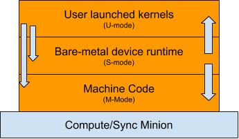

Slave Minion Firmware {#slave_minion_firmware}
=====================

The "Slave" Minions are comprized of two groups:

* The Sync Minions which are Minions 16-31 of the master-shire
* The Compoute Minions which are all Minions in shire 0-31.

## Sync Minion Functionality
\todo expand the sync minion basic functionality

## Compute Minions Functionality
\todo expand the compute minion basic functionality

## Software Stack

In the Sync and Compute Minions we are going to be running the following SW stack

<!---
Source google-doc
https://docs.google.com/drawings/d/10bnoxE4Wy9-b_aglycwSChRgr2Td1q7ijy0uOpgFZcg/edit?usp=sharing
--->

The softwre stack has the following components, top to bottom:

* **Execution Kernels**: The execution kernels and generated by the Glow-backend and are
loaded on the device through the Host-SW-Stack and Master-Minion. The
execution-kernels run in user-mode that is the lowest privileged level.

* **Bare-metal Device Runtime** The device-untime will be used by the Master-Minion
FW to launch, reset and terminate execution-kernels. This runtime will be running in S-mode.

* **Machine Code** The Machine-code is a thin layer of  low level services that are not
supported directly by hardware (setting SATP, …). This software layer will run in M-mode.

\todo Explain the need for having code running in u-mode and not in s or m-mode expand on the attach / security concerns.

\todo Provide link to the machine mode reference.

## Bare-metal Device Runtime API

The device runtime (s-mode)  will provide the following functionality to
the execution-kernels (u-mode).

* **Yield** : The kernel is done and wants to yield the minion to the supervisor.
When all minions of a kernel yield, the dispathcer runnin on the Master-Minion
knows that it can schedule a new kernel on the shires used by the kernel

* **Scratchpad control change**: The kernel wants to enable/disable the Dcache split
mode in the minion. It needs to request access as it is not directly available through
user-mode CSRs.

* **FMA lanes 2..7 disable**: The kernel might want to disable/enable FMA lanes 2..7
to save leakage. It needs to request access as it is not directly available through
user-mode CSRs.

* **Evict DCache** : The kernel wants to flush all the contents of the minion dcache
to L2 and also wipe out the valid bits in the dcache.
\todo Do we want to provide this? Scratchpad control change have similar effects anway

The transition from u-mode to s-mode is implemneted using the *ECALL* instruction.

\todo What is required in terms of validating the correctness of each runtime call ?
How do we now that the arguments passed are correct?

## Machine-Code API

\todo Fill what are the explicit services that the bare-metal device runtime software
will request to m-code.

## M-mode “transparent” traps
\todo List all the events that will create a trap and cause an m-code call when not specifically
defined in the RiscV documentation.
* Instructions not supported natively
* Dcache control CSR write
2
3
