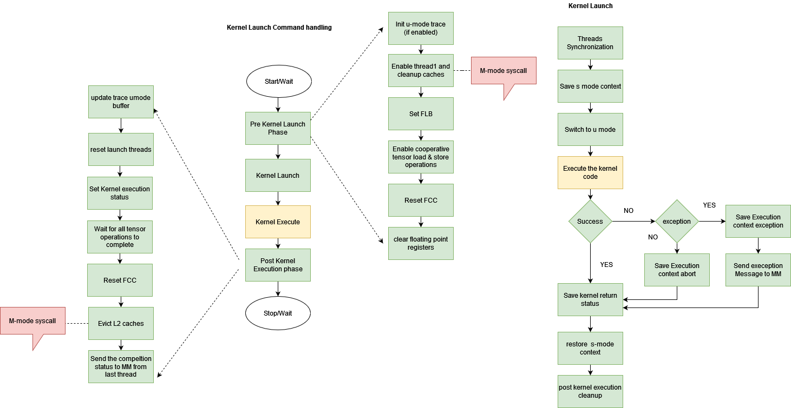
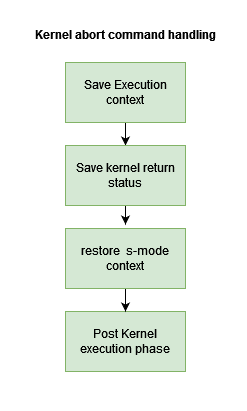

.. _Worker Minion (WM) Software Stack:
*********************************
Worker Minion (WM) Software Stack
*********************************

The worker minion software stack is split into three logical components:

- **WM Firmware:** The WM firmware is the core component that interfaces with the Master-Minion firmware to launch, reset and terminate execution-kernels. The WM firmware execute in S-mode.
- **Machine Mode Firmware:** The machine mode code is a thin layer of low level services that are not supported directly by the S and U mode CSRs. This component runs in the M-mode.
- **Execution Kernels:** The execution kernels are generated by the Glow-backend and are loaded on the device through the Host-SW-Stack and Master-Minion. The execution-kernels run in U-mode. The execution of kernel adheres to principle of executing with least privileges and using the syscall interface for privileged operations.

The Worker Minions software stack executes on two groups of compute minions:

- The Compute Minions which are Minions 16-31 of the master-shire 32
- The Compute Minions which are all Minions in shire 0-31

Worker Minion Runtime main goal is to manage the execution of User Mode Kernels on the Compute Minion Shires which includes handling MM->CM commands, preparing Minion State prior to launch kernels, managing privilege request from User Kernel, and also eventually cleaning up Minion State post kernel execution. In case User Kernels takes exception, Compute Minion Runtime will handle the exception.

.. _WM Firmware:
****************
WM Firmware
****************
This section deep dives into various operations supported by the WM firmware. These operations are dispatched by the MM RT. The MM RT copies the commands parameters for respective operations into the global buffer accessible by the WM, followed by the notification using IPI. The notification is multicast to all the shires & HARTS required to perform the operation. The WM firmware decodes the commands and commence the requested operation.

For detials of interface between the CM & MM, please see the MM RT documentation.

The WM firmware supports following operations:

- Kernel Execution
- Kernel Abort
- Trace configuration and dynamic control
- PMC configuration

.. _Kernel Execution:
Kernel Execution
================

The kernel execution operation comprises of 3 phases:

- **Pre kernel Execution Phase** Set up the clean execution environment for kernel such as caches maintenance, reset FCC, configure Tensor control etc

- **Kernel Execution Phase** Save the context and transfer control to kernel code in the the u-mode

- **Post Kernel Execution Phase** This entails reporting the kernel execution status to MM and cleaning up the resources assigned to kernel.

All these phases are elaborated in the following section.

Pre Kernel Execution Phase
--------------------------

All the shires and the respective threads slated for kernel execution receive a multi-cast message from MM  RT for kernel execution. The kernel image and arguments are already copied into the memory by the MM RT (DMA Worker). The received kernel command contains kernel entry point and arguments location.

- All the participating threads enable u-mode tracing if enabled in the kernel command parameters
- Cleans up caches, evicts the shared L1 i-caches, disable L1 d-cache split and scratch pad.
     - The shire level initialization are performed only by first minion in each shire. Furthermore,these initialization are split across threads 0 & 1 to balance the load distribution
- Initializes the kernel execution status, Fast Local Barriers (FLBs), enable cooperative tensor load and store operations. These steps are carried out by thread-1 of each shire.
- Initializes the Fast Credit Counters(FCCs)
- Initializes floating point unit (lanes,registers etc)
- Waits for cache maintenance and memory operations to complete (fence instruction)

Pre kernel Execution phase is mostly carried out in the S-mode. Few M-mode calls are made along the way to perform the privilege operations such cache maintenance, thread enablement etc.

Kernel Execution Phase
----------------------
After the kernel execution environment has been setup, the WM firmware waits for all the participating threads the reach the sync point.Once threads have reached the sync point their state is updated to the kernel execution. Following actions are performed:

- The s-mode context is saved and control is transferred to kernel entry point in u-mode
- Kernel execution takes place in u-mode. The code flow varies from this point onward depending on the kernel completion status
	- **Success:** kernel return status is saved in the global and context is restored
	- **Kernel exceptions:**
		- Kernel return status is saved
		- Kernel execution context is saved in the user provided buffer  to assist with the debugging.

		Please note that the exceptions are routed to S-mode via M-mode code. u-mode kernel exceptions are trapped into M-mode which delegates them to S-mode.
	- **Kernel self abort:**
		- This occurs when the thread aborts the kernel execution. In this case, kernel code is directly trapped into S-mode. The S-mode saves the execution status and context.
	- **Kernel force abort:** Initiated by the MM RT due to timeout/hang. This scenario is covered in the nest section.

- The S-mode context is restored and post kernel execution steps are performed.

For detials of error reporting please see the table below:
+-------------------------------------------------------------------------+-----------------------------------------------------------------------------------------+---------------------------------------------------------------------------------------------------------------------------------------------------------------------------------------------------------------------------------------------------------------------------------------------------------------------------------------------------------------------------------------------------------------------+
|                                                                         |                                                                                         |                                                                                                                                                                                                                                                                                                                                                                                                                     |
+-------------------------------------------------------------------------+-----------------------------------------------------------------------------------------+---------------------------------------------------------------------------------------------------------------------------------------------------------------------------------------------------------------------------------------------------------------------------------------------------------------------------------------------------------------------------------------------------------------------+
| **Type of Error**                                                       | **Type**                                                                                | **Action**                                                                                                                                                                                                                                                                                                                                                                                                          |
+-------------------------------------------------------------------------+-----------------------------------------------------------------------------------------+---------------------------------------------------------------------------------------------------------------------------------------------------------------------------------------------------------------------------------------------------------------------------------------------------------------------------------------------------------------------------------------------------------------------+
| User Kernel exception, self abort                                       | CM Recoverable                                                                          | *   Compute RT will save Architecture Context into User provided exception buffer (see Kernel Launch Command)                                                                                                                                                                                                                                                                                                       |
|                                                                         |                                                                                         |                                                                                                                                                                                                                                                                                                                                                                                                                     |
|                                                                         | *   Means CM Hart wont need MM to intervene to recover from the error condition         | *   CM RT perform self abort                                                                                                                                                                                                                                                                                                                                                                                        |
|                                                                         |                                                                                         |                                                                                                                                                                                                                                                                                                                                                                                                                     |
|                                                                         |                                                                                         |     *   Clear out its Architecture State                                                                                                                                                                                                                                                                                                                                                                            |
|                                                                         |                                                                                         |                                                                                                                                                                                                                                                                                                                                                                                                                     |
|                                                                         |                                                                                         | *   CM Issues “`User Kernel Exception`” message to MM                                                                                                                                                                                                                                                                                                                                                               |
|                                                                         |                                                                                         |                                                                                                                                                                                                                                                                                                                                                                                                                     |
|                                                                         |                                                                                         | *   MM will issue Abort other Shires                                                                                                                                                                                                                                                                                                                                                                                |
|                                                                         |                                                                                         |                                                                                                                                                                                                                                                                                                                                                                                                                     |
|                                                                         |                                                                                         | *   MM response “`Exception`“ or “`Self Abort`” to Kernel Launch Response to Host RT                                                                                                                                                                                                                                                                                                                                |
|                                                                         |                                                                                         |                                                                                                                                                                                                                                                                                                                                                                                                                     |
|                                                                         |                                                                                         | *   Host RT has option to pull “Exception Content” using “`Data Move Operation`”                                                                                                                                                                                                                                                                                                                                    |
+-------------------------------------------------------------------------+-----------------------------------------------------------------------------------------+---------------------------------------------------------------------------------------------------------------------------------------------------------------------------------------------------------------------------------------------------------------------------------------------------------------------------------------------------------------------------------------------------------------------+
| Compute User Kernel hangs                                               | MM Recoverable                                                                          | *   MM Virtual Timer service will signal the timeout                                                                                                                                                                                                                                                                                                                                                                |
|                                                                         |                                                                                         |                                                                                                                                                                                                                                                                                                                                                                                                                     |
| *   Triggered by:                                                       | *   Means MM intervention is required to recover MM Hart error condition                | *   MM will issue IPI to CM RT to perform teardown                                                                                                                                                                                                                                                                                                                                                                  |
|                                                                         |                                                                                         |                                                                                                                                                                                                                                                                                                                                                                                                                     |
|     *   CM never responds to Kernel Launch after the Time Out Threshold |                                                                                         | *   Handler will check if its Compute Kernel Hang or Runtime Hang                                                                                                                                                                                                                                                                                                                                                   |
|                                                                         |                                                                                         |                                                                                                                                                                                                                                                                                                                                                                                                                     |
|                                                                         |                                                                                         | *   If Compute Kernel Hang                                                                                                                                                                                                                                                                                                                                                                                          |
|                                                                         |                                                                                         |                                                                                                                                                                                                                                                                                                                                                                                                                     |
|                                                                         |                                                                                         |     *   Compute RT will save Architecture Context into User provided abort(i.e. same as exception) buffer                                                                                                                                                                                                                                                                                                           |
|                                                                         |                                                                                         |                                                                                                                                                                                                                                                                                                                                                                                                                     |
|                                                                         |                                                                                         |     *   CM RT issues “`COMPUTE KERNEL Exception`” to MM                                                                                                                                                                                                                                                                                                                                                             |
|                                                                         |                                                                                         |                                                                                                                                                                                                                                                                                                                                                                                                                     |
|                                                                         |                                                                                         | *   MM will issue Abort to other Compute MinShires                                                                                                                                                                                                                                                                                                                                                                  |
|                                                                         |                                                                                         |                                                                                                                                                                                                                                                                                                                                                                                                                     |
|                                                                         |                                                                                         | *   MM issues “Warm Reset” to the CM which hit the “Abort“ and thus it will restart reboot                                                                                                                                                                                                                                                                                                                          |
|                                                                         |                                                                                         |                                                                                                                                                                                                                                                                                                                                                                                                                     |
|                                                                         |                                                                                         |     *   Start with Machine Mode                                                                                                                                                                                                                                                                                                                                                                                     |
|                                                                         |                                                                                         |                                                                                                                                                                                                                                                                                                                                                                                                                     |
|                                                                         |                                                                                         |     *   Jump to Supervisor Mode                                                                                                                                                                                                                                                                                                                                                                                     |
|                                                                         |                                                                                         |                                                                                                                                                                                                                                                                                                                                                                                                                     |
|                                                                         |                                                                                         |     *   Eventually send “Ready” indication                                                                                                                                                                                                                                                                                                                                                                          |
|                                                                         |                                                                                         |                                                                                                                                                                                                                                                                                                                                                                                                                     |
|                                                                         |                                                                                         | *   Meantime MM will block all new incoming commands from Host till all CMs have acknowledged to be in “Ready“ state                                                                                                                                                                                                                                                                                                |
|                                                                         |                                                                                         |                                                                                                                                                                                                                                                                                                                                                                                                                     |
|                                                                         |                                                                                         | *   MM response “`Exception`“ or “`Self Abort`” to Kernel Launch Response to Host RT                                                                                                                                                                                                                                                                                                                                |
|                                                                         |                                                                                         |                                                                                                                                                                                                                                                                                                                                                                                                                     |
|                                                                         |                                                                                         | *   Host RT has option to pull “Exception Content” using “`Data Move Operation`”                                                                                                                                                                                                                                                                                                                                    |
+-------------------------------------------------------------------------+-----------------------------------------------------------------------------------------+---------------------------------------------------------------------------------------------------------------------------------------------------------------------------------------------------------------------------------------------------------------------------------------------------------------------------------------------------------------------------------------------------------------------+
| Compute RT exception, errors                                            | MM Recoverable until Error Threshold is hit                                             | *   Compute RT will save exception context into “Fixed location Exception Buffer ” S Mode DDR location - not accessible by User Kernel                                                                                                                                                                                                                                                                              |
|                                                                         |                                                                                         |                                                                                                                                                                                                                                                                                                                                                                                                                     |
|                                                                         | *   Means MM intervention is required to recover MM Hart error condition                | *   CM RT issues “`COMPUTE RT Exception`” message to MM                                                                                                                                                                                                                                                                                                                                                             |
|                                                                         |                                                                                         |                                                                                                                                                                                                                                                                                                                                                                                                                     |
|                                                                         | *   If SP maintained “Error Counters” hit _threshold\*_, then require Host intervention |     *   MM will send MM->SP “Update Error Count” to SP to keep track # of outstanding “Errors”. If Threshold is hit, then SP DM Error handler will sent Asynchronous Error event to Host PCIE Driver which will be captured in DMesg as per Error event architecture: [Device Management Work Package 4 - Requirements & Design (In progress)](https://esperantotech.atlassian.net/wiki/spaces/SW/pages/1647739547) |
|                                                                         |                                                                                         |                                                                                                                                                                                                                                                                                                                                                                                                                     |
|                                                                         |                                                                                         | *   MM issues “Warm Reset” to the CM RT which hit the “Exception“ and thus it will restart reboot                                                                                                                                                                                                                                                                                                                   |
|                                                                         | \*_Build Time Threshold = 5 (Fine tune in Si)_                                          |                                                                                                                                                                                                                                                                                                                                                                                                                     |
|                                                                         |                                                                                         |     *   Start with Machine Mode                                                                                                                                                                                                                                                                                                                                                                                     |
|                                                                         |                                                                                         |                                                                                                                                                                                                                                                                                                                                                                                                                     |
|                                                                         |                                                                                         |     *   Jump to Supervisor Mode                                                                                                                                                                                                                                                                                                                                                                                     |
|                                                                         |                                                                                         |                                                                                                                                                                                                                                                                                                                                                                                                                     |
|                                                                         |                                                                                         |     *   Eventually send “Ready” indication                                                                                                                                                                                                                                                                                                                                                                          |
|                                                                         |                                                                                         |                                                                                                                                                                                                                                                                                                                                                                                                                     |
|                                                                         |                                                                                         | *   Meantime MM will block all new incoming commands from Host till all CMs have acknowledged to be in “Ready“ state                                                                                                                                                                                                                                                                                                |
+-------------------------------------------------------------------------+-----------------------------------------------------------------------------------------+---------------------------------------------------------------------------------------------------------------------------------------------------------------------------------------------------------------------------------------------------------------------------------------------------------------------------------------------------------------------------------------------------------------------+
| Compute RT hangs                                                        | MM Recoverable until Error Threshold is hit                                             | *   MM Virtual Timer will signal the timeout                                                                                                                                                                                                                                                                                                                                                                        |
|                                                                         |                                                                                         |                                                                                                                                                                                                                                                                                                                                                                                                                     |
| *   Triggered by:                                                       | *   Means MM intervention is required to recover MM Hart error condition                | *   MM will issues IPI to CM RT to perform teardown                                                                                                                                                                                                                                                                                                                                                                 |
|                                                                         |                                                                                         |                                                                                                                                                                                                                                                                                                                                                                                                                     |
|     *   MM → CM Multicast no response                                   | *   If SP maintained “Error Counters” hit _threshold\*_, then require Host intervention | *   Handler will check if its Compute Kernel Hang or Runtime Hang                                                                                                                                                                                                                                                                                                                                                   |
|                                                                         |                                                                                         |                                                                                                                                                                                                                                                                                                                                                                                                                     |
|                                                                         |                                                                                         | *   If Compute Runtime Hang                                                                                                                                                                                                                                                                                                                                                                                         |
|                                                                         | \*_Build Time Threshold = 5 (Fine tune in Si)_                                          |                                                                                                                                                                                                                                                                                                                                                                                                                     |
|                                                                         |                                                                                         |     *   Compute RT will save exception context into “Fixed location Abort (i.e. same Exception) Buffer ” S Mode DDR location - not accessible by User Kernel                                                                                                                                                                                                                                                        |
|                                                                         |                                                                                         |                                                                                                                                                                                                                                                                                                                                                                                                                     |
|                                                                         |                                                                                         |     *   MM will send MM->SP “Update Error Count” to SP to keep track # of outstanding “Errors”. If Threshold is hit, then SP DM Error handler will sent Asynchronous Error event to Host PCIE Driver which will be captured in DMesg as per Error event architecture: [Device Management Work Package 4 - Requirements & Design (In progress)](https://esperantotech.atlassian.net/wiki/spaces/SW/pages/1647739547) |
|                                                                         |                                                                                         |                                                                                                                                                                                                                                                                                                                                                                                                                     |
|                                                                         |                                                                                         | *   MM issues “Warm Reset” to the CM RT which hit the “Abort“ and thus it will restart reboot                                                                                                                                                                                                                                                                                                                       |
|                                                                         |                                                                                         |                                                                                                                                                                                                                                                                                                                                                                                                                     |
|                                                                         |                                                                                         |     *   Start with Machine Mode                                                                                                                                                                                                                                                                                                                                                                                     |
|                                                                         |                                                                                         |                                                                                                                                                                                                                                                                                                                                                                                                                     |
|                                                                         |                                                                                         |     *   Jump to Supervisor Mode                                                                                                                                                                                                                                                                                                                                                                                     |
|                                                                         |                                                                                         |                                                                                                                                                                                                                                                                                                                                                                                                                     |
|                                                                         |                                                                                         |     *   Eventually send “Ready” indication                                                                                                                                                                                                                                                                                                                                                                          |
|                                                                         |                                                                                         |                                                                                                                                                                                                                                                                                                                                                                                                                     |
|                                                                         |                                                                                         | *   Meantime MM will block all new incoming commands from Host till all CMs have acknowledged to be in “Ready“ state                                                                                                                                                                                                                                                                                                |
+-------------------------------------------------------------------------+-----------------------------------------------------------------------------------------+---------------------------------------------------------------------------------------------------------------------------------------------------------------------------------------------------------------------------------------------------------------------------------------------------------------------------------------------------------------------------------------------------------------------+

Post Kernel Execution Phase
---------------------------
Following operations are performed in the post kernel execution phase

- Reset the thread states and save the kernel execution status in the global
- Wait for all the hardware operations to complete(memory access, cache ops,  tensor operations)
- Empty all FCC and wait for all the threads to reach sync point
- Evict the L1 and L2 d-caches
- Sent the completions status to MM

.. _Kernel Abort:
Kernel Abort
============
MM RT sends the kernel abort request to WM firmware under a couple of situations:

- Kernel execution timeout e.g kernel is hung.
- Operation is no longer needed.

The kernel abort sequence breaks down into following steps:

- WM firmware receives the software interrupt which is handed down by the machine mode code to start the kernel abort sequence.
- WM firmware saves the kernel execution context to assist with the debugging.
- WM firmware Restores the S-mode context and saves the kernel return status .
- WM firmware triggers post kernel execution sequence, as described in the last section.

.. _Trace Control:
Trace Control
=============
These operations are used to configure trace parameters such as:
- Shires and HARTS to trace
- Events to trace.
- Dynamically control (enable/disable) tracing
- Trace buffer reset

.. _PMC configuration:
PMC configuration
=================
PMC configuration is used by the MM RT to configure performance monitor counters. This is done using syscall into the M-mode

*********************
Machine Mode Firmware
*********************

The machine mode component provides the low level, highest privileged services to S-mode and U-mode. This includes:
- Cache maintenance operations
- PMC configuration, sampling and reset
- Threads control
- Dynamic PLL frequency updates

Most importantly, the machine mode code traps the IPI from the MM RT and exceptions from the u-mode kernel and delegates them to the S-mode firmware.
For details, see the Machine Minion documentation.